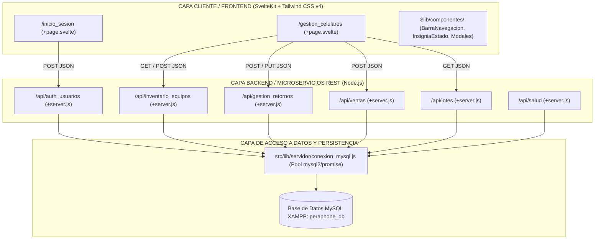

# DOCUMENTO DE ARQUITECTURA Y CUMPLIMIENTO TÉCNICO
## SISTEMA EMPRESARIAL DE GESTIÓN DE INVENTARIOS Y TRAZABILIDAD "PERAPHONE"

---

* **Propietario / Cliente:** Luis Baldivieso
* **Empresa:** Peraphone
* **Desarrollador Principal (Lead Dev):** Alejandro Paucara
* **Fecha de Emisión:** 23 de Septiembre de 2026
* **Versión del Documento:** 1.0 - Definitiva para Producción

---

## 1. FICHA TÉCNICA DEL PROYECTO

| Parámetro | Definición Tecnológica |
| :--- | :--- |
| **Arquitectura de Software** | Separación Estricta: Microservicios API REST (Backend) y Aplicación Reactiva Desacoplada (Frontend). |
| **Framework Full-Stack** | SvelteKit 2 sobre Node.js. |
| **Motor Reactivo Frontend** | Svelte 5 con arquitectura moderna de Runes (`$state`, `$derived`, `$effect`, `$props`). |
| **Diseño y Estilizado** | Tailwind CSS v4 (100% responsivo para móviles, tablets y monitores de escritorio). |
| **Motor de Base de Datos** | MySQL 8.x / MariaDB mediante XAMPP y phpMyAdmin. |
| **Motor de Almacenamiento DB** | InnoDB (Soporte nativo de transacciones ACID y llaves foráneas referenciales). |
| **Juego de Caracteres** | `utf8mb4` con cotejamiento `utf8mb4_unicode_ci`. |
| **Conector de Base de Datos** | `mysql2/promise` configurado con Connection Pool de alta concurrencia. |

---

## 2. ARQUITECTURA DEL SISTEMA Y SEPARACIÓN DE RESPONSABILIDADES

El sistema fue concebido bajo el principio de **desacoplamiento total**: el Frontend jamás ejecuta sentencias SQL ni accede directamente al servidor MySQL. Toda interacción pasa por una capa intermedia de microservicios REST que validan tipos de datos, autenticidad y reglas de negocio.

### Directiva de Nomenclatura en Español y Cero Redundancias:
* Todas las carpetas, archivos, variables y funciones están redactadas en **español claro y descriptivo**.
* Se eliminaron redundancias innecesarias (no existen rutas como `productos/productos/+page.svelte` ni `celulares/celulares`).
* Estructura limpia: `/inicio_sesion`, `/gestion_celulares`, `/api/inventario_equipos`, `/api/gestion_retornos`, etc.

---

## 3. MATRIZ EXHAUSTIVA DE CUMPLIMIENTO: REGLAS DE NEGOCIO (RN-001 A RN-009)

A continuación se detalla cómo cada una de las 9 reglas de negocio exigidas se encuentra blindada a nivel de **Base de Datos**, **Backend (Microservicios)** y **Frontend (Vistas y Componentes)**:

---

### RN-001: Autenticación Estricta
> *"Acceso solo mediante credenciales válidas; los usuarios externos o inactivos están bloqueados."*

1. **En Base de Datos (`peraphone_db.sql`):**
   - Tabla `usuarios`:
     - Columna `contrasena_hash VARCHAR(255) NOT NULL`: Almacena la clave procesada criptográficamente con algoritmo `SHA-256`.
     - Columna `estado ENUM('activo', 'inactivo') NOT NULL DEFAULT 'activo'`.
2. **En el Backend (`src/routes/api/auth_usuarios/+server.js`):**
   - Recibe `nombre_usuario` y `contrasena`.
   - Hashea la clave recibida con SHA-256 y la coteja contra la base de datos.
   - Si las credenciales no existen o no coinciden, emite `401 Unauthorized`.
   - **Bloqueo a inactivos/externos:** Si `usuario.estado === 'inactivo'`, emite un rechazo inmediato `403 Forbidden` informando que el usuario ha sido revocado.
   - Genera una cookie de sesión cifrada `peraphone_sesion`.
3. **En el Frontend (`src/routes/inicio_sesion/+page.svelte`):**
   - Formulario corporativo con validación en cliente. Si las credenciales son incorrectas, muestra feedback visual de error y bloquea el acceso al panel operativo.

---

### RN-002: Roles de Usuario y Privilegios Diferenciados
> *"Restringir acceso según funciones (ej. Vendedor, Personal de Inventario, Servicio Técnico). El Administrador tiene acceso total."*

1. **En Base de Datos:**
   - Tabla `roles` con registros formales:
     - `1`: `Administrador`
     - `2`: `Vendedor`
     - `3`: `Personal de Inventario`
     - `4`: `Servicio Técnico`
   - Llave foránea `fk_usuario_rol` que garantiza que ningún usuario exista sin rol válido.
2. **En el Backend (RBAC - Role-Based Access Control):**
   - `/api/auth_usuarios` calcula y entrega el objeto de permisos (`puede_registrar_inventario`, `puede_vender`, `puede_evaluar_tecnico`, `puede_ver_todo`).
   - Cada microservicio valida independientemente el rol antes de procesar cualquier transacción:
     - `POST /api/inventario_equipos`: Rechaza con `403 Forbidden` a usuarios que no sean *Personal de Inventario* o *Administrador*.
     - `POST /api/ventas`: Rechaza con `403 Forbidden` a usuarios que no sean *Vendedor* o *Administrador*.
     - `PUT /api/gestion_retornos`: Rechaza con `403 Forbidden` a usuarios que no sean *Servicio Técnico* o *Administrador*.
3. **En el Frontend (`src/routes/gestion_celulares/+page.svelte`):**
   - La interfaz se adapta reactivamente al rol:
     - Si ingresa **Carlos Mendoza (Vendedor)**: Se oculta el botón `+ Registrar Nuevo Celular` y el botón `🔧 Evaluar`. Se activa el botón verde `🏷️ Vender` en los equipos disponibles.
     - Si ingresa **Mariana Rojas (Inventario)**: Se activa el botón `+ Registrar Nuevo Celular` y la selección de lotes. Se ocultan los botones de venta y evaluación técnica.
     - Si ingresa **Jorge Gutiérrez (Servicio Técnico)**: Se activa el botón naranja `🔧 Evaluar` en los celulares en revisión. Se ocultan registros de stock y ventas.
     - Si ingresa **Luis Baldivieso (Administrador)**: Acceso irrestricto a todas las herramientas.

---

### RN-003: Registro Mínimo de Inventario y Control de Estados
> *"Se requieren datos mínimos (IMEI, marca, modelo). Se permiten estados operativos como 'pendiente de recepción'."*

1. **En Base de Datos:**
   - Tabla `celulares`:
     - `numero_imei VARCHAR(15) NOT NULL UNIQUE`: Restricción estricta de unicidad y obligatoriedad.
     - `marca VARCHAR(50) NOT NULL` y `modelo VARCHAR(50) NOT NULL`.
     - `estado_equipo ENUM('pendiente_recepcion', 'disponible', 'vendido', 'en_revision', 'en_reparacion', 'desechado') DEFAULT 'disponible'`.
2. **En el Backend (`src/routes/api/inventario_equipos/+server.js`):**
   - Validación por expresión regular: `/^[0-9]{15}$/`. Si el IMEI no tiene exactamente 15 dígitos numéricos, la petición es rechazada con `400 Bad Request`.
   - Verificación de duplicados previa a la inserción.
3. **En el Frontend (`src/lib/componentes/ModalFormulario.svelte`):**
   - Campo de entrada optimizado con tipografía monoespaciada, compatible con pistolas lectoras de código de barras USB/Bluetooth.
   - Selector que permite inicializar el equipo en `'disponible'` o `'pendiente_recepcion'`.

---

### RN-004: Control y Agrupación por Lotes
> *"Agrupación por lotes con ID y fecha, permitiendo también registros individuales sin lote."*

1. **En Base de Datos:**
   - Tabla `lotes` (`id_lote`, `codigo_lote UNIQUE`, `descripcion`, `proveedor`, `fecha_recepcion`, `estado_lote`).
   - En la tabla `celulares`, la columna `id_lote` es nullable (`INT NULL`), con relación `CONSTRAINT fk_celular_lote FOREIGN KEY (id_lote) REFERENCES lotes(id_lote) ON DELETE SET NULL`.
2. **En el Backend:**
   - Microservicio `GET /api/lotes`: Provee el catálogo dinámico de lotes con conteo de celulares vinculados.
   - `POST /api/inventario_equipos`: Si se envía un lote, valida su existencia; si el campo viene vacío, asigna `NULL` en la base de datos sin errores de integridad.
3. **En el Frontend:**
   - Desplegable de selección con lotes activos o la opción predeterminada *"-- Sin Lote (Registro Individual) --"*.
   - En la tabla se visualiza la insignia `📦 LOTE-2024-001` o el texto *`Individual (Sin Lote)`*.

---

### RN-005: Registro Inmutable de Movimientos y Automatización
> *"Registrar toda entrada, salida, traslado o ajuste con motivo, fecha y responsable. Movimientos automáticos deben etiquetarse."*

1. **En Base de Datos:**
   - Tabla `movimientos` (`id_movimiento`, `id_celular`, `tipo_movimiento`, `motivo`, `fecha_hora`, `id_usuario_responsable`, `ubicacion_origen`, `ubicacion_destino`, `es_automatico`).
   - La tabla no posee sentencias de borrado ni edición; es un registro histórico aditivo.
2. **En el Backend:**
   - Empleo de transacciones atómicas `ejecutarTransaccion()` en `conexion_mysql.js`.
   - Al registrar un celular (Entrada), al venderlo (Salida), al devolverlo (Traslado a taller) o al dictaminar (Ajuste técnico), se ejecuta automáticamente una inserción en `movimientos` con la bandera booleana `es_automatico = TRUE`.
3. **En el Frontend (`src/lib/componentes/ModalTrazabilidad.svelte`):**
   - Cada evento automático se resalta con la etiqueta de sistema: `⚙️ Movimiento Automatizado del Sistema`.

---

### RN-006: Ventas y Descuento Inmediato de Stock
> *"Descontar stock al vender. Prohibido vender sin stock, salvo pre-ventas."*

1. **En Base de Datos:**
   - Tabla `ventas` con columnas `id_celular INT NULL`, `id_usuario_vendedor INT`, `precio_venta_final DECIMAL(10,2)` y `es_preventa BOOLEAN DEFAULT FALSE`.
2. **En el Backend (`src/routes/api/ventas/+server.js`):**
   - Si `es_preventa = FALSE`: Comprueba que el celular exista físicamente y que su estado sea estrictamente `'disponible'`.
   - Si el equipo está en `'en_revision'`, `'en_reparacion'` o `'vendido'`, la venta es rechazada de inmediato.
   - Si es válida, dentro de una misma transacción ACID:
     1. Actualiza `celulares.estado_equipo = 'vendido'`.
     2. Inserta el registro en la tabla `ventas`.
     3. Inserta el movimiento de salida en `movimientos`.
3. **En el Frontend:**
   - El botón `🏷️ Vender` solo se renderiza en celulares con badge verde `Disponible`.
   - Modal interactivo de venta donde el vendedor ingresa nombre y cédula del cliente. Al confirmarse, el contador de stock disponible disminuye y los vendidos aumentan.

---

### RN-007: Devoluciones y Bloqueo en "En Revisión"
> *"Registrar equipo (IMEI), cliente, motivo y poner el estado temporalmente en 'En revisión'."*

1. **En Base de Datos:**
   - Tabla `devoluciones` (`id_devolucion`, `id_celular`, `id_usuario_receptor`, `nombre_cliente`, `contacto_cliente`, `motivo_devolucion`, `fecha_devolucion`, `estado_resolucion`).
2. **En el Backend (`src/routes/api/gestion_retornos/+server.js` - POST):**
   - Transacción atómica que ejecuta:
     1. `UPDATE celulares SET estado_equipo = 'en_revision' WHERE id_celular = ?`.
     2. `INSERT INTO devoluciones (...) VALUES (...)`.
     3. `INSERT INTO movimientos (tipo_movimiento='TRASLADO', motivo='DEVOLUCION_CLIENTE...')`.
3. **En el Frontend:**
   - Modal de devolución rápida accesible mediante el botón `↩️ Devolver`.
   - Al procesarse, el equipo cambia inmediatamente su badge al color amarillo: **`En Revisión (Retorno)`**, quedando inhabilitado para la venta.

---

### RN-008: Evaluación Exclusiva de Servicio Técnico
> *"Servicio técnico decide si el equipo en revisión vuelve a stock, pasa a reparación o se desecha. No se puede vender mientras esté en revisión."*

1. **En Base de Datos:**
   - Tabla `evaluaciones_tecnicas` (`id_evaluacion`, `id_devolucion`, `id_celular`, `id_usuario_tecnico`, `dictamen_final`, `diagnostico_detallado`, `fecha_evaluacion`).
   - Restricción: `dictamen_final ENUM('disponible', 'en_reparacion', 'desechado')`.
2. **En el Backend (`src/routes/api/gestion_retornos/+server.js` - PUT):**
   - Verifica que el usuario sea *Servicio Técnico* o *Administrador*.
   - Aplica la transición dictaminada en la base de datos:
     - `'disponible'`: El equipo retorna a stock habilitado para la venta.
     - `'en_reparacion'`: Se mantiene en taller con insumos requeridos.
     - `'desechado'`: Se declara baja definitiva (chatarra).
   - Marca la devolución asociada como `estado_resolucion = 'resuelto'` y genera el movimiento de auditoría.
3. **En el Frontend:**
   - El botón naranja `🔧 Evaluar` solo se visualiza para celulares en amarillo (`en_revision`) y exclusivamente cuando la sesión pertenece a Servicio Técnico o Administrador.

---

### RN-009: Trazabilidad Inmutable y Logs de Auditoría
> *"Historial inmutable de cada celular. Solo el administrador autoriza correcciones, guardando el log."*

1. **En Base de Datos:**
   - Tabla `logs_auditoria` (`id_log`, `id_usuario_admin`, `accion`, `tabla_afectada`, `id_registro_afectado`, `valores_anteriores JSON`, `valores_nuevos JSON`, `motivo_correccion`, `fecha_hora`).
   - Se mantiene la integridad histórica de movimientos sin sobreescritura física.
2. **En el Backend:**
   - Consulta especializada: `GET /api/inventario_equipos?imei_trazabilidad=...`.
   - Obtiene la secuencia temporal completa de todos los movimientos y responsables asociados al IMEI.
3. **En el Frontend (`ModalTrazabilidad.svelte`):**
   - Cualquier usuario puede hacer clic en `📜 Historial` en la tabla para auditar la línea de tiempo completa del celular: desde su entrada original, pasando por ventas, devoluciones y evaluaciones técnicas.

---

## 4. MAPEO DE LOS 4 ENTREGABLES DEL PROYECTO

### Entregable 1: Script SQL Completo
* **Archivo:** `peraphone_db.sql` (en la raíz del proyecto).
* **Características:** Contiene el DDL completo de las 9 tablas relacionales, llaves foráneas con integridad referencial (`ON DELETE RESTRICT / SET NULL / CASCADE`), índices optimizados para IMEI y estados, así como los datos semilla de roles, usuarios con claves encriptadas, lotes y celulares de prueba.

### Entregable 2: Conexión de Base de Datos
* **Archivo:** `src/lib/servidor/conexion_mysql.js`.
* **Características:** Emplea `mysql2/promise` para soportar programación asíncrona no bloqueante. Implementa un pool de hasta 10 conexiones simultáneas y la función `ejecutarTransaccion()` para asegurar atomicidad (BEGIN, COMMIT y ROLLBACK). Se configura de manera dinámica con variables de entorno en `.env`.

### Entregable 3: Microservicios Backend (Node.js REST)
* `src/routes/api/auth_usuarios/+server.js`: Autenticación, validación de estado activo y asignación de roles (**RN-001, RN-002**).
* `src/routes/api/inventario_equipos/+server.js`: Listado filtrado, registro atómico con validación de 15 dígitos de IMEI y trazabilidad inmutable (**RN-003, RN-004, RN-005, RN-009**).
* `src/routes/api/gestion_retornos/+server.js`: Procesamiento de devoluciones y dictamen técnico (**RN-007, RN-008**).
* `src/routes/api/ventas/+server.js`: Registro de ventas ordinarias y preventas con descuento de stock (**RN-006**).
* `src/routes/api/lotes/+server.js`: Consulta y listado de lotes para selectores de interfaz.
* `src/routes/api/salud/+server.js`: Endpoint de monitoreo de conexión en vivo con MySQL en XAMPP.

### Entregable 4: Vistas Frontend Responsivas y Componentes
* `src/routes/inicio_sesion/+page.svelte`: Pantalla de acceso corporativo Peraphone con selector de cuentas demo para pruebas.
* `src/routes/gestion_celulares/+page.svelte`: Tablero operativo con 4 tarjetas de métricas en tiempo real, búsqueda por IMEI, filtros cromáticos y tabla reactiva con control estricto de roles.
* Componentes modulares en `src/lib/componentes/`:
  - `BarraNavegacion.svelte`: Cabecera corporativa con rol activo y logout.
  - `InsigniaEstado.svelte`: Badges cromáticos según estado del equipo.
  - `TarjetaMetrica.svelte`: Tarjetas ejecutivas para Luis Baldivieso.
  - `ModalFormulario.svelte`: Modal de alta de equipos (compatible con pistola láser).
  - `ModalTrazabilidad.svelte`: Modal de historial forense inmutable.
  - `NotificacionAlerta.svelte`: Alertas flotantes (toast) de éxito y error.

---

## 5. GUÍA DE DEMOSTRACIÓN Y VERIFICACIÓN EN VIVO

Para demostrar el funcionamiento a evaluadores o a Luis Baldivieso:

1. **Prueba de Rol Vendedor (Carlos Mendoza - `vendedor123`):**
   - Inicia sesión. Observa que el botón de registro de celular está oculto.
   - Observa que el equipo en revisión (amarillo) no tiene botón de evaluación.
   - Haz clic en `🏷️ Vender` en un equipo disponible (verde), ingresa cliente y documento y confirma la venta. Verás cómo el equipo pasa a `Vendido`, el stock disponible baja en 1 y los vendidos suben en 1.
2. **Prueba de Rol Servicio Técnico (Jorge Gutiérrez - `tecnico123`):**
   - Inicia sesión.
   - Localiza el celular en estado `En Revisión (Retorno)` y pulsa `🔧 Evaluar`.
   - Selecciona dictamen `Disponible`, escribe el diagnóstico y confirma. El celular volverá a stock disponible para que los vendedores lo puedan comercializar.
3. **Prueba de Trazabilidad (Cualquier usuario o Administrador):**
   - Pulsa `📜 Historial` en cualquier fila y comprueba la línea de tiempo inalterable con cada paso histórico del celular.

---
**Elaborado y certificado por:** Alejandro Paucara  
*Desarrollador Principal - Sistema Peraphone*
